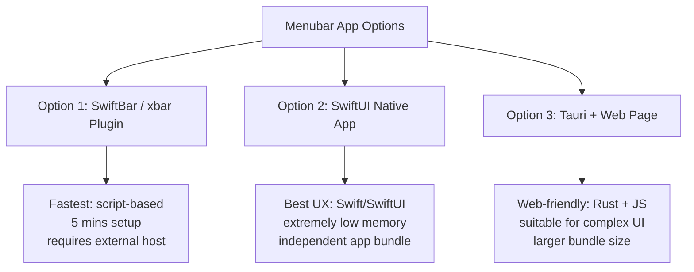

# Architecture: Standup App

This document outlines the architecture, decision choices, and current state machine model for the **Standup** macOS menubar application.

---

## 1. Menubar App Options & Decision

The options below were evaluated during discovery:



### Options Comparison

| Option | Dev Time | Resource Footprint | Distribution | Best Use Case |
| :--- | :--- | :--- | :--- | :--- |
| **SwiftBar / xbar** | 5 mins | Extremely low (< 10MB) | ❌ Needs host app | Personal scripts, quick validation |
| **SwiftUI Native** | 2 hours | Extremely low (~20MB) | ✅ Independent `.app` | Premium native feel, long-term use |
| **Tauri** | 1 hour | Low (~50MB) | ✅ Independent `.app` | Complex custom Web-based UI |

*Decision: **SwiftUI Native** was chosen to achieve a premium, zero-dependency, low-overhead native experience.*

---

## 2. State Machine Model

The app treats awake screen-session time as the source of truth for continuous sitting time. Keyboard/pointer idle time is still observed, but only to label quiet input periods; it no longer resets or pauses the active session while the display and user session remain awake. This avoids missing reminders when the user is reading, watching, thinking, or otherwise sitting at the computer without constant keyboard or pointer input.

```mermaid
stateDiagram-v2
    [*] --> Inactive : App Launch

    Inactive --> Active : Awake Screen Tick
    note on Active
        1. Accumulate ScreenTime
        2. Clear QuietInput when input/media is recent
    end note

    Active --> QuietInput : No Input (> 1 min)
    note on QuietInput
        1. Continue ScreenTime accumulation
        2. Track quiet input duration for status only
    end note

    QuietInput --> Active : Input/Media Resumed
    note on Active
        Clear QuietInput and keep accumulated ScreenTime
    end note

    Active --> Inactive : Screen sleeps, session locks, or manual reset
    QuietInput --> Inactive : Screen sleeps, session locks, or manual reset
    note on Inactive
        Reset ScreenTime = 0
    end note

    Active --> ReminderTriggered : ScreenTime >= target
    QuietInput --> ReminderTriggered : ScreenTime >= target
    note on ReminderTriggered
        1. Enter needsStandUp state
        2. Loop menubar icon animation
    end note
    
    ReminderTriggered --> Inactive : Screen sleeps, session locks, manual reset, or overlay auto-reset
    ReminderTriggered --> Active : User snoozes reminder (30 min/45 min/1 hour/2 hours)
    Active --> ReminderTriggered : Snooze expires while still over target
```

The state is represented by these published fields in `ActivityTracker`:

- `activeSeconds`: accumulated continuous awake screen-session time. It continues through no-input periods until the screen sleeps, the session locks, or the user resets.
- `idleSeconds`: elapsed quiet-input time after the idle threshold is crossed.
- `isIdle`: whether the app is currently in a quiet-input period.
- `hasScreenSession`: whether a continuous screen session has started and should keep accumulating sitting time.
- `isQuietScreenSession`: whether the user has been quiet at the keyboard/pointer while screen time still accumulates.
- `needsStandUp`: whether the active-time target has been reached and the menubar icon should animate.
- `snoozeUntil`: optional deadline used to hide the overlay and suppress reminders without resetting active time.
- `targetActiveSeconds`: selected active-time goal before the reminder appears.

---

## 3. macOS API Implementation details

### System Idle Time (`HIDIdleTime`)
Utilizes IOKit's `HIDIdleTime` to retrieve seconds elapsed since the last physical input (keyboard/mouse):
```swift
import Foundation
import IOKit

func getSystemIdleTime() -> Double? {
    var iterator: io_iterator_t = 0
    let result = IOServiceGetMatchingServices(kIOMainPortDefault, IOServiceMatching("IOHIDSystem"), &iterator)
    guard result == kIOReturnSuccess else { return nil }
    defer { IOObjectRelease(iterator) }

    let service = IOIteratorNext(iterator)
    guard service != 0 else { return nil }
    defer { IOObjectRelease(service) }

    var dict: Unmanaged<CFMutableDictionary>?
    guard IORegistryEntryCreateCFProperties(service, &dict, kCFAllocatorDefault, 0) == kIOReturnSuccess,
          let properties = dict?.takeRetainedValue() as? [String: Any],
          let idleTimeNanoseconds = properties["HIDIdleTime"] as? Int64 else {
        return nil
    }

    return Double(idleTimeNanoseconds) / 1_000_000_000.0
}
```

### Video Playback & Meetings Detection (`IOPMCopyAssertionsStatus`)
Queries IOKit power management assertions directly so videos, presentations, and meetings stay classified as active screen time rather than quiet input:
```swift
import IOKit.pwr_mgt

func hasDisplaySleepAssertion() -> Bool {
    var assertionsStatus: Unmanaged<CFDictionary>?
    let result = IOPMCopyAssertionsStatus(&assertionsStatus)
    guard result == kIOReturnSuccess,
          let status = assertionsStatus?.takeRetainedValue() as? [String: Any] else {
        return false
    }

    if let value = status["PreventUserIdleDisplaySleep"] as? Int {
        return value > 0
    }
    if let value = status["PreventUserIdleDisplaySleep"] as? NSNumber {
        return value.intValue > 0
    }
    return false
}
```

### Lock Screen & Display Sleep
Subscribes to `NSWorkspace` notifications to reset the screen session when the user locks their screen or the display sleeps:
- `NSWorkspace.screensDidSleepNotification`
- `NSWorkspace.sessionDidResignActiveNotification`

---

## 4. Menubar UI Contract

The `MenuBarExtra` label renders `AnimatedMenuBarIcon(tracker:)` plus a compact status indicator. The menubar icon uses dedicated 288x288 template PNG assets (`MenuBarCatDesk.png` and `MenuBarCatDeskSparkle.png`) scaled to 18x18 points, so it reliably appears in the macOS menu bar. The asset shows a large computer screen and desk plus a back-view seated cat with ears and tail:

- Active and not reminding: show the seated-cat-at-desk glyph and the active minute count.
- `needsStandUp`: blink a small mint sparkle by using the existing 0.12-second animation clock. Runtime crossfade is intentionally disabled to avoid menu-bar shimmer.
- Quiet input during a screen session: keep showing the active minute count and keep the focus ring green because screen time is still counting.
- Before the first screen-session tick: show an orange ready indicator.

The larger overlay animation uses 16 generated filled-silhouette transparent 128x128 template PNG frames with extra padding so the sitting chair pose stays inside the bounds. The Finder and `/Applications` icon uses `Resources/AppIcon.icns`, generated from a 1024x1024 liquid-glass source icon with a seated-to-standing figure and a green-to-mint accent.

The menu content is backed by the same `ActivityTracker` instance, so manual reset, screen sleep, and session lock all clear `needsStandUp` and return the icon to the non-reminding state. `MenuContentView` relies on the native menu window material as the only panel and adds no custom rounded background inside it; content is separated with clearer crystal row dividers, green-to-mint inline icon tiles matching the focus ring, lightweight value controls, a custom switch, and pill buttons. The menu exposes a target-time menu backed by `StandupTimingOptions`; the selected value is persisted with `AppStorage` and applied to `ActivityTracker` immediately via an explicit setter method. The menu also exposes a **Start at Login** toggle backed by `LaunchAtLoginController`, which registers or unregisters the app with `SMAppService.mainApp` and keeps the UI state aligned with the system service status after success or failure.

When `needsStandUp` becomes true, `ReminderOverlayController` opens a borderless full-screen overlay on the main display. The overlay uses a glass material background with a light tint instead of an opaque scrim, shows a larger animated stand-up icon, a 5-minute countdown backed by `ReminderOverlayCountdown`, a **Reset** button, and a bottom-centered **Remind me later** control with clear glass buttons for 30 min, 45 min, 1 hour, and 2 hours. Pressing **Reset**, pressing Escape, or letting the countdown reach zero calls `ActivityTracker.reset()`, closes the overlay, and plays one system beep. Snooze calls `ActivityTracker.snoozeReminder(for:)`, closes the overlay without a beep, keeps active time intact, and allows the reminder to return after the selected deadline if the user is still over the target.

---

## 5. Security and Open Source Posture

The current app source is local-only: it has no app network client, telemetry, accounts, cloud sync, or remote configuration. The security boundary is documented in [`docs/security.md`](security.md), and the public vulnerability reporting process is documented in [`../SECURITY.md`](../SECURITY.md).

The repository includes MIT licensing and open-source preparation files:

- [`../LICENSE`](../LICENSE)
- [`../README.md`](../README.md)
- [`../SECURITY.md`](../SECURITY.md)
- [`../CONTRIBUTING.md`](../CONTRIBUTING.md)
- [`open_source.md`](open_source.md)

Public binary releases should be signed and notarized before broad distribution. Source-only publication should still verify generated image asset provenance before pushing to a public repository.
