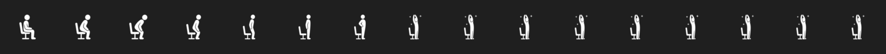

# Current Implementation: Standup App Icons and Menu UI

The Standup app uses a high-quality generated app icon for Finder and `/Applications`, a crisp cat-at-workstation menubar glyph for the always-visible status item, and a larger generated-frame animation for the full-screen reminder overlay.

Here is the shipped 16-frame preview sheet:

Generated bitmap source images were reprocessed into 16 padded 128x128 transparent template PNG frames (`standup_0.png` to `standup_15.png`) for the reminder overlay. Frames `8` through `15` extend the final standing pose and blink the sparkle so the stand-up moment lasts longer. A newer generated liquid-glass source was also processed into `Resources/AppIcon.png` and `Resources/AppIcon.icns` for the macOS bundle icon.

## Implemented Changes

### Assets and Build System

- [`Resources/standup_0.png`](../Resources/standup_0.png)
- [`Resources/standup_1.png`](../Resources/standup_1.png)
- [`Resources/standup_2.png`](../Resources/standup_2.png)
- [`Resources/standup_3.png`](../Resources/standup_3.png)
- [`Resources/standup_4.png`](../Resources/standup_4.png)
- [`Resources/standup_5.png`](../Resources/standup_5.png)
- [`Resources/standup_6.png`](../Resources/standup_6.png)
- [`Resources/standup_7.png`](../Resources/standup_7.png)
- [`Resources/standup_8.png`](../Resources/standup_8.png)
- [`Resources/standup_9.png`](../Resources/standup_9.png)
- [`Resources/standup_10.png`](../Resources/standup_10.png)
- [`Resources/standup_11.png`](../Resources/standup_11.png)
- [`Resources/standup_12.png`](../Resources/standup_12.png)
- [`Resources/standup_13.png`](../Resources/standup_13.png)
- [`Resources/standup_14.png`](../Resources/standup_14.png)
- [`Resources/standup_15.png`](../Resources/standup_15.png)
- [`Resources/MenuBarCatDesk.png`](../Resources/MenuBarCatDesk.png)
- [`Resources/MenuBarCatDeskSparkle.png`](../Resources/MenuBarCatDeskSparkle.png)
- [`Resources/AppIcon.png`](../Resources/AppIcon.png)
- [`Resources/AppIcon.icns`](../Resources/AppIcon.icns)

[`build.sh`](../build.sh) copies the `Resources` directory into the app bundle at `${CONTENTS_DIR}/Resources` and declares `CFBundleIconFile` as `AppIcon.icns`.

### Open Source and Security

The repository is prepared for open-source publication with these root policy files:

- [`LICENSE`](../LICENSE): MIT License with `Standup contributors` as the holder.
- [`README.md`](../README.md): project overview, build/test commands, privacy/security summary, contribution pointer, and license pointer.
- [`SECURITY.md`](../SECURITY.md): supported-version policy, vulnerability reporting process, and current security model.
- [`CONTRIBUTING.md`](../CONTRIBUTING.md): development workflow, security-reporting rule, and pull request checklist.
- [`.gitignore`](../.gitignore): excludes SwiftPM build products, app bundles, and local editor/system artifacts.

[`docs/security.md`](security.md) documents the app's local-only security boundary, macOS capabilities, data handling, and release security checklist. [`docs/open_source.md`](open_source.md) tracks the open-source readiness checklist and maintenance rules.

### Core Logic

[`ActivityTracker.swift`](../Sources/StandupCore/ActivityTracker.swift) owns the reminder state:

- `@Published public var needsStandUp: Bool = false` tracks whether the active time target has been reached.
- `@Published public private(set) var snoozeUntil` stores the optional snooze deadline used to suppress reminders without resetting active time.
- `@Published public var targetActiveSeconds` holds the selected reminder duration. `setTargetActiveSeconds(_:)` normalizes menu selections and applies them immediately to the tracker.
- `hasScreenSession` and `isQuietScreenSession` distinguish awake screen time from quiet keyboard/pointer periods so browsing, reading, watching, and thinking continue to count as screen time.
- In `tick()`, the tracker increments `activeSeconds` for each awake screen-session tick. Recent keyboard/pointer input or a display-sleep assertion clears `idleSeconds`; quiet input increments `idleSeconds` for status only.
- Keyboard/pointer silence no longer resets active time. The app resets when macOS reports screen sleep, the user session resigns active, the user manually resets, or the reminder overlay auto-reset completes.
- When `activeSeconds >= targetActiveSeconds`, the tracker sets `needsStandUp = true` and triggers the notification once unless `snoozeUntil` is still in the future. It does not call `reset()` immediately.
- `snoozeReminder(for:)` accepts the supported snooze durations, hides the reminder, keeps `activeSeconds` intact, and lets the reminder return after the deadline if the user is still active.
- In `reset()`, the tracker clears `needsStandUp` and `snoozeUntil` along with the active and idle timers.
- The session is reset by screen sleep, session lock/resign, the overlay reset path, or the user clicking "Reset Session".

[`StandupTimingOptions.swift`](../Sources/StandupCore/StandupTimingOptions.swift) defines the selectable timing values:

- Target reminder: 15m, 30m, 45m, 1h, 1h 30m, 2h.
- Unsupported stored values normalize back to the 1h target default.

[`ReminderSnoozeOptions.swift`](../Sources/StandupCore/ReminderSnoozeOptions.swift) defines overlay snooze durations: 30 min, 45 min, 1 hour, and 2 hours. Unsupported snooze requests normalize to 30 min.

### UI and Animation

[`AnimatedMenuBarIcon.swift`](../Sources/Standup/AnimatedMenuBarIcon.swift) renders dedicated 288x288 template PNG assets as an 18x18-point cat workstation icon. The assets use a large computer screen, desk, and a back-view seated cat with ears and tail, so the icon reliably appears in the menu bar and reads as desk-work posture:

- Working/Active: static seated-cat-at-desk glyph plus the active minute count.
- Reminding/needsStandUp: blinks a small mint sparkle on late animation frames so the stand-up moment reads longer.
- Quiet input during screen time: static seated-cat-at-desk glyph plus the active minute count because screen time is still counting.
- Before the first screen-session tick: static seated-cat-at-desk glyph with an orange ready indicator in the menubar label.

The generated 16-frame PNG sequence remains available through `AnimatedStandupIcon` for the larger reminder overlay, where the bitmap detail has enough room to read clearly.

[`StandupApp.swift`](../Sources/Standup/StandupApp.swift) uses `AnimatedMenuBarIcon(tracker: tracker)` in the `MenuBarExtra` label.

[`MenuContentView.swift`](../Sources/StandupCore/Views/MenuContentView.swift) relies on the native menu window material as the only panel and does not draw a custom rounded background inside it. The menu uses clearer crystal row dividers, green-to-mint inline icon tiles that match the focus ring, a lightweight target value control, a custom switch, and pill buttons. During a screen session, the main time display and progress ring continue to show screen time even when the user is temporarily quiet; quiet input appears only as secondary status text. The target selection is persisted with `AppStorage`, applied to `ActivityTracker` on menu open, and applied immediately when changed.

[`MenuDesignMetrics.swift`](../Sources/StandupCore/MenuDesignMetrics.swift) keeps the dropdown proportions and glass clarity centralized: 268-point width, 20-point controls, 30-point icon space, a compact 82-point progress ring, and opacity constants for the crystal controls and icon tiles.

[`ReminderOverlayController.swift`](../Sources/Standup/ReminderOverlayController.swift) shows a borderless full-screen reminder overlay when `needsStandUp` becomes true. [`ReminderOverlayView.swift`](../Sources/Standup/ReminderOverlayView.swift) uses a glass material background, displays the larger animated icon, a **Reset** button, a bottom-centered **Remind me later** row, clear glass buttons for 30 min/45 min/1 hour/2 hours, and a 5-minute auto-reset countdown. Pressing **Reset**, pressing Escape, or countdown completion calls `ActivityTracker.reset()`, closes the overlay, and plays one system beep. Snooze closes the overlay without a beep and does not reset active time.

[`LaunchAtLoginController.swift`](../Sources/StandupCore/LaunchAtLoginController.swift) owns the **Start at Login** setting shown in the menu. It uses `SMAppService.mainApp` to register or unregister the app, refreshes from the system service status, and reports registration errors without flipping the toggle into an incorrect state.

### Tests

[`StandupTests.swift`](../Tests/StandupTests/StandupTests.swift) covers the activity state machine, quiet-input screen-time accrual, screen-session state, media assertion handling, target-time reminder state, reset and snooze behavior, timing option normalization, menu bar icon sizing/animation timing, generated cat menubar and app icon resources, bundle metadata, dropdown design metrics, overlay countdown, bottom-centered clear snooze control metrics, Escape reset behavior, launch-at-login state handling, MIT license files, security reporting docs, open-source docs, `.gitignore`, and the current no-network source boundary.

---

## Verification Plan

### Automated Tests
- Run `swift test` in the terminal to verify all test cases pass.

### Manual Verification
1. Run `./build.sh` to compile and package `Standup.app`.
2. Launch the app using `open build/Standup.app`.
3. Verify that the sitting icon appears in the macOS menubar.
4. Click on the menubar icon, change the target picker, close and reopen the menu, and verify that the selected value persists.
5. Click **Test Bell** to trigger the reminder (sets time to 2 seconds before target).
6. Verify that:
   - System notification triggers.
   - The menubar icon starts animating at the smaller menu-bar size.
   - The animation advances smoothly without flicker and matches the menu bar's color scheme (adapts to light/dark mode).
   - A full-screen glass reminder overlay appears with the larger animated stand-up icon.
   - The overlay countdown starts at 5:00 and counts down toward auto-reset.
7. Click **Reset** in the overlay and verify that the overlay closes, the icon resets back to the static sitting icon, and the system plays one beep.
8. Trigger the reminder again, press Escape, and verify the same reset-and-beep behavior.
9. Trigger the reminder again, choose **30 min** from **Remind me later**, and verify that the overlay closes without a beep and active time is not reset.
10. Trigger the reminder again and let the overlay countdown reach zero to verify the same reset-and-beep behavior happens automatically.
11. Toggle **Start at Login** in the menu, close and reopen the menu, and verify that the toggle reflects the current macOS login item state.
